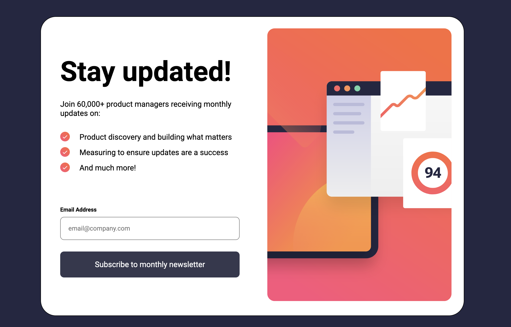

<h1 align="center">Newsletter sign-up form</h1>

 <a align="center" href="https://ctrlaltsudo.github.io/Newsletter-sign-up-form-with-success-message/">Live Demo</a>

 <a align="center" href="https://www.frontendmentor.io/challenges/newsletter-signup-form-with-success-message-3FC1AZbNrv/hub?share=true">Solution Page</a>

<h2 align="center">Project Screenshot<h2>

  </img>

## Description

This is a Frontend Mentor challenge, click the link above to visit the challenge page. 

## Built with 

HTML

CSS

Flexbox

Vanilla JS

## What I learnt 

This may be the first I've changed the default bullet-points on unorganised lists, or at least from what I remember... I'm sure I'll need to repeat how I did that another 20 times before I remember.

## Authors

<a href="https://github.com/CtrlAltSudo">CtrlAltSudo</a>.

## Acknowledgments 

ChatGPT for showing and explaining how to use the ::before pseudo class